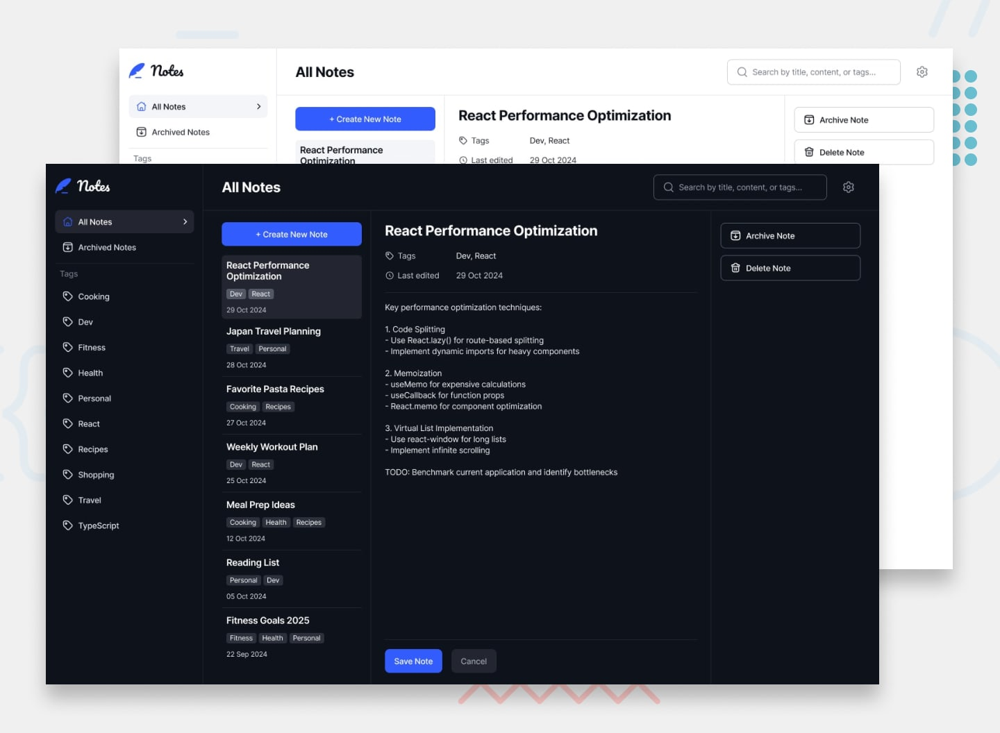

# Note-taking Web App



A full-stack note-taking application built as a solution to the [Frontend Mentor Note-taking Web App challenge](https://www.frontendmentor.io/challenges/note-taking-web-app-773r7bUfOG).

## Features

- Create, read, update, and delete notes
- Archive and restore notes
- Filter notes by tag
- Search notes by title, tag, and content
- Color and font theme selection (persisted per user)
- Full keyboard navigation
- Responsive layout (mobile, tablet, desktop)
- User authentication with JWT + refresh token rotation
- Password reset flow

## Tech Stack

**Client**
- React + Vite + TypeScript
- Tailwind CSS v4
- clsx

**Server**
- Node.js + Express + TypeScript
- Prisma ORM + MySQL
- JWT (access + refresh token rotation)
- Zod (request validation)

## Project Structure

```
notes-app/
├── client/       # React + Vite frontend
├── server/       # Express + Prisma backend
├── design/       # Figma design file (not committed)
└── preview.jpg
```

## Getting Started

### Prerequisites

- Node.js 18+
- MySQL running locally
- Yarn

### Setup

```bash
# Install dependencies
yarn install

# Server: copy env and fill in your values
cp server/.env.example server/.env

# Run database migrations
cd server && yarn db:migrate

# Start both client and server
yarn dev
```

The client runs on `http://localhost:3000` and the server on `http://localhost:4000`.

### Environment variables

See `server/.env.example` for all required variables. Generate token secrets with:

```bash
node -e "console.log(require('crypto').randomBytes(64).toString('hex'))"
```

## Scripts

| Command | Description |
|---|---|
| `yarn dev` | Start client and server concurrently |
| `yarn dev:client` | Start client only |
| `yarn dev:server` | Start server only |
| `yarn build` | Build both for production |
| `yarn workspace server db:migrate` | Run Prisma migrations |
| `yarn workspace server db:studio` | Open Prisma Studio |
